# state_research — Diagrams

## Interpreter SM — Code Execution I/O Cycle

`01-interpreter-elm.mmd` → `01-interpreter-elm.svg`

---

## Single agent — user talks, agent reasons and acts

`01-single-agent.mmd` → `01-single-agent.svg`

---

## Single agent — decorator-based state machine

`01-single-agent-elm.mmd` → `01-single-agent-elm.svg`

---

